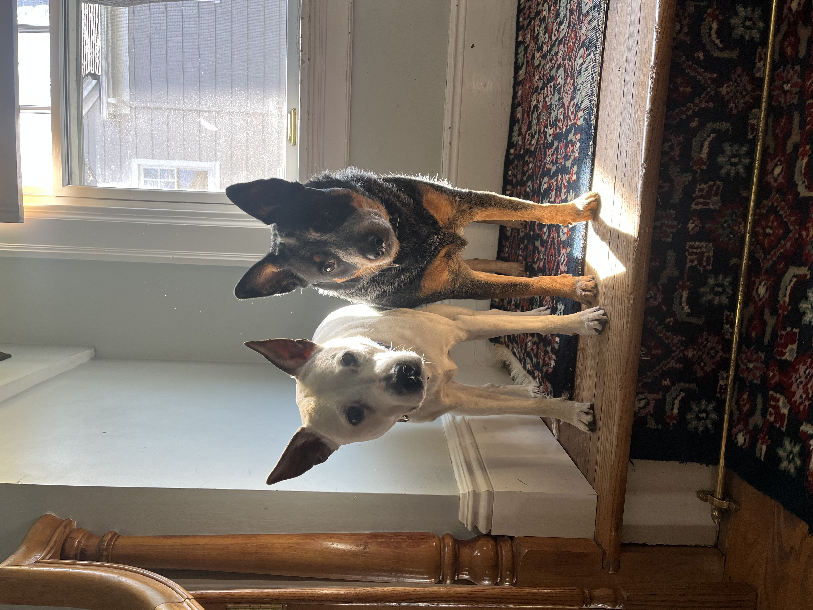

+++
title = "About"
aliases = ["contact"]
author = "Owen Drummond"
date = "2023-04-10"
+++

I am graduate student in mathematics currently studying at Rutgers University. I graduated in May 2022 with my Bachelor's in Mathematics at New York University. My interests include geometric analysis, differential geometry and geometric flows. Currently, I am completing a Master's Thesis on Energy Minimizing Maps and the application of Simon-Lojasiewicz to the uniqueness of tangent maps/flows under Professor Natasa Sesum. These are my two beloved dogs Piper and Molly. Piper is a red heeler mix, and Molly is a blue heeler Australian Cattle Dog.

