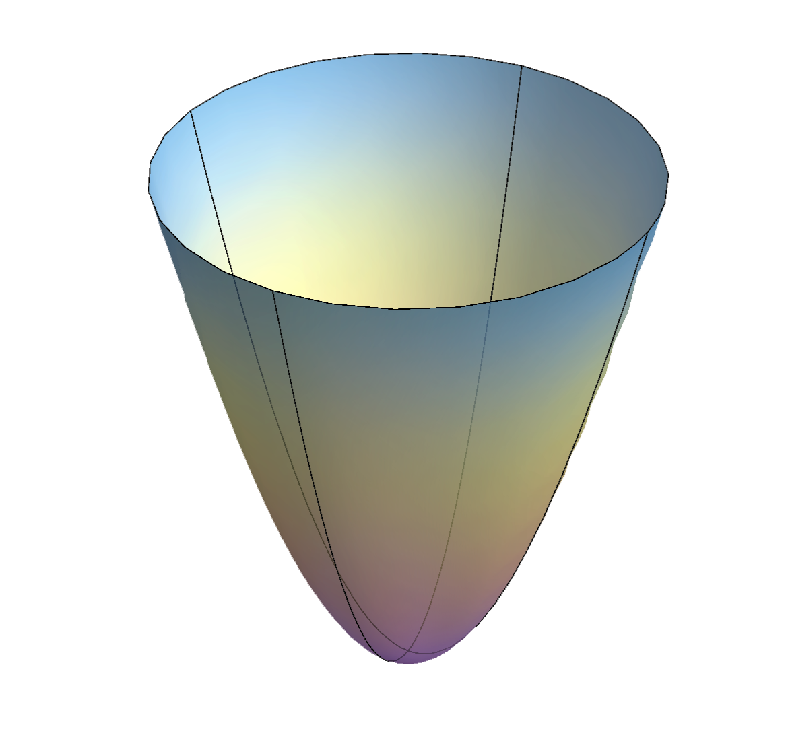

In this article, we will examine the nature and utility of the first fundamental form, a quadratic form on a surface. Given a curve parametrized by 

\(u=u(t)\)

and

\(v=v(t)\)

which lies on a surface 

\(X\)

parametrized by

\(X=X(u,v)\)

we have that 

$$
ds = |\frac{dX}{dt}| dt = |X_u \frac{du}{dt} + X_v \frac{dv}{dt}| dt = \sqrt{(X_u \dot{u} + X_v \dot{v}) \cdot (X_u \dot{u} + X_v \dot{v})}
$$

Now defining the coefficients, called the First Fundamental Form coefficients E, F and G, we have 

$$
E=X_u \cdot X_u, F=X_u \cdot X_v, G=X_v \cdot X_v
$$

and moreover,

$$
\sqrt{(X_u \dot{u} + X_v \dot{v}) \cdot (X_u \dot{u} + X_v \dot{v})} = \sqrt{Edu^2 + 2F du dv + Gdv^2}
$$

by direct computation. Now the **First Fundamental Form**, denoted I, is defined as

$$
I=ds^2=dX \cdot dX = Edu^2 + 2F du dv + Gdv^2
$$

This quadratic form allows us to derive the curvature and metric properties of any surface, namely arc length and area. We see that 

$$
(X_{u} \times X_{v})^2=(X_{u} \times X_{v}) \cdot (X_{u} \times X_{v}) = (X_{u} \cdot X_{u})(X_{v} \cdot X_{v})-(X_{u} \cdot X_{v})^2=EG - F^2 \geq 0
$$
 
and because 

\(E>0\)

we have that I is positive definite, i.e. 

\(I \geq 0\)

and 

\(I=0 \iff du=dv=0\)

It is worth nothing that I also has the symmetric matrix representation

$$
I=x^T 
\begin{pmatrix}
E & F \\
F & G 
\end{pmatrix} 
y
$$

where

\(x,y\)

are vectors.

##Example 1: Arc Length of a Line on a Paraboloid##

Let 

\(u(t)=t\)

and

\(v(t)=t\)

be the equation of a line which lies on the paraboloid parametrized by

$$
X(u,v) = (u,v,u^2+v^2)
$$

and let 

\(0 \geq t \geq 1\)

and

\(0 \geq u,v \geq 1\)


We will use the first fundamental form to evaluate this arc length. First we see that

$$
E=X_u \cdot X_u = 1+4u^2 \tab
F=X_u \cdot X_v = 4uv \tab
G=X_v \cdot X_v = 1+v^2
$$

substituting 

\(u(t)\)

and

\(v(t)\)

in, we have that 
$$
E= 1+4t^2 \tab
F= 4t^2 \tab
G= 1+t^2
$$
Now, we have our equation

$$
ds=\sqrt{Edu^2 + 2F du dv + Gdv^2} dt=\sqrt{E \dot{u}^2 + 2F \dot{u} \dot{v} + G \dot{v}^2} dt = \sqrt{2+16t^2} dt= 4 \sqrt{\frac{1}{8} + t^2} dt
$$
Finally, we have that our arc length is given by
$$
\ell = \int_{0}^{1} ds = 4 \int_{0}^{1} \sqrt{\frac{1}{8} + t^2} dt
$$
This is quite a difficult integral, which is usually the case when computing arc length, but we do obtain an analytical antiderivative, so our definite integral has the solution
$$
\ell = 4 (\frac{t}{8} \sqrt{16t^2} + \frac{1}{16} ln (\sqrt{8t^2+1}+2\sqrt{2}t) |_{0}^{1}) = \frac{1}{2} (3\sqrt{2}+\frac{1}{2} ln(2+2 \sqrt{2})) \approx 2.562
$$